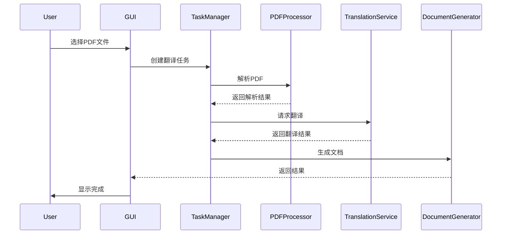
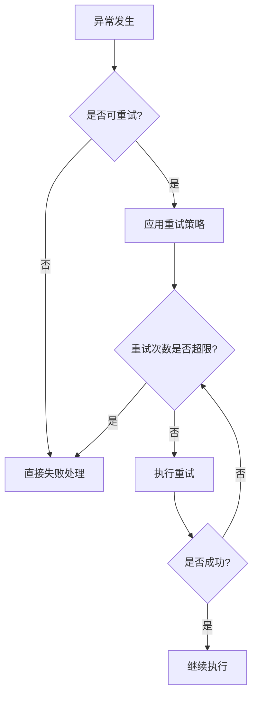
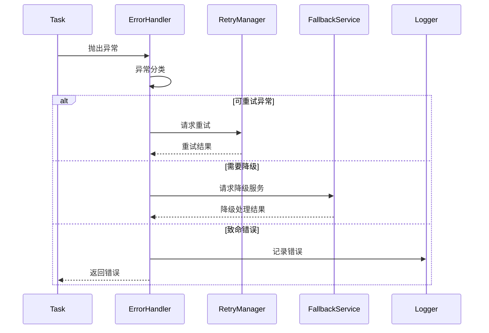
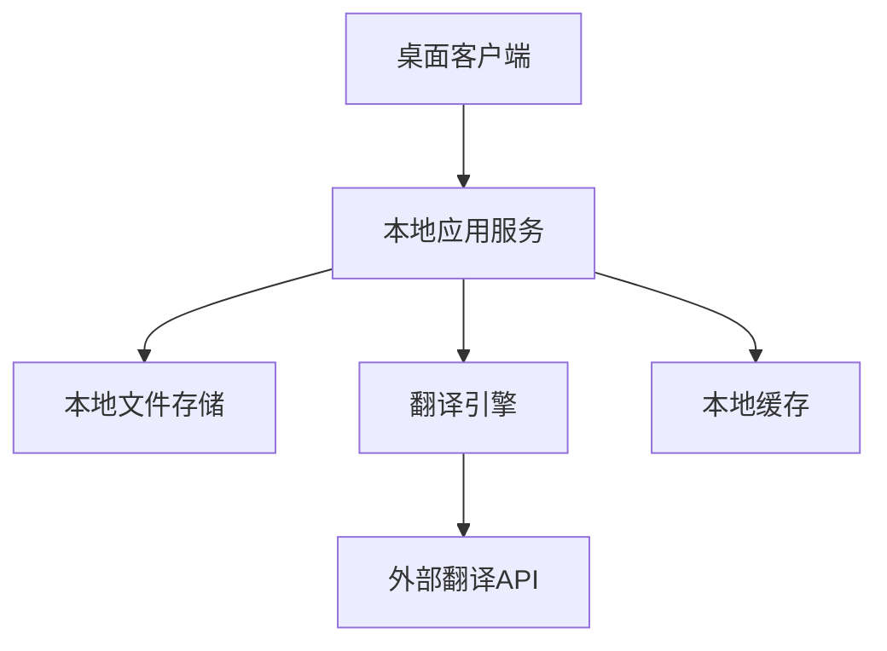

<h1 align = "center">架构分析</h1>

## 一、总体架构
系统采用**分层架构**来组织整个系统，分为几个核心模块：

### 1. 表现层（Presentation Layer）
- 负责用户界面和交互
- 提供GUI和CLI两种交互方式
- 处理用户输入和结果展示

### 2. 应用层（Application Layer）
- 协调各个核心功能模块
- 处理业务流程和任务调度
- 提供API接口支持

### 3. 领域层（Domain Layer）
- 实现核心业务逻辑
- 包含PDF处理、翻译、文档生成等核心功能
- 定义领域模型和业务规则

### 4. 基础设施层（Infrastructure Layer）
- 提供技术支持和外部服务集成
- 处理数据持久化
- 管理第三方服务调用


## 二、系统模块划分

### 1. 表现层设计

#### 1.1 GUI模块
- 技术选型：Gradio
- 主要组件：
  * 主窗口（MainWindow）
  * 文件选择器（FileSelector）
  * 翻译配置面板（TranslationConfig）
  * 进度显示器（ProgressDisplay）
  * 预览窗口（PreviewWindow）

#### 1.2 CLI模块
- 命令行参数解析
- 配置文件支持
- 进度展示
- 日志输出

### 2. 应用层设计

#### 2.1 任务管理器（TaskManager）
- 功能：
  * 任务队列管理
  * 并发控制
  * 任务状态追踪
  * 异常处理

#### 2.2 配置管理器（ConfigManager）
- 功能：
  * 用户配置管理
  * 翻译服务配置
  * 系统参数配置
  * 持久化存储

### 3. 领域层设计

#### 3.1 PDF处理模块（PDFProcessor）
- 核心功能：
  * 文档解析（DocumentParser）
  * 内容提取（ContentExtractor）
  * 布局分析（LayoutAnalyzer）
  * 特殊元素识别（ElementDetector）

#### 3.2 翻译模块（TranslationService）
- 核心组件：
  * 翻译引擎抽象（TranslationEngine）
  * 服务适配器（ServiceAdapter）
  * 翻译优化器（TranslationOptimizer）
  * 缓存管理（CacheManager）

#### 3.3 文档生成模块（DocumentGenerator）
- 主要功能：
  * 布局重建（LayoutReconstructor）
  * 内容合成（ContentComposer）
  * 格式转换（FormatConverter）
  * 样式应用（StyleApplier）

### 4. 基础设施层设计

#### 4.1 存储模块（StorageService）
- 组件：
  * 文件存储（FileStorage）
  * 缓存存储（CacheStorage）
  * 配置存储（ConfigStorage）

#### 4.2 外部服务集成（ExternalServices）
- 服务类型：
  * 翻译API集成
  * OCR服务集成
  * 云存储集成

#### 4.3 通用工具（CommonUtils）
- 工具类：
  * 日志管理（LogManager）
  * 错误处理（ErrorHandler）
  * 性能监控（PerformanceMonitor）

## 三、关键流程设计

### 1. 文档翻译流程


### 2. 异常处理流程

#### 2.1 异常分类
1. PDF处理异常
   - 文件读取异常（FileReadError）
   - PDF格式异常（PDFFormatError）
   - 内容提取异常（ContentExtractionError）
   - 布局分析异常（LayoutAnalysisError）

2. 翻译服务异常
   - API调用异常（APICallError）
   - 服务限流异常（RateLimitError）
   - 翻译质量异常（TranslationQualityError）
   - 网络连接异常（NetworkError）

3. 资源异常
   - 内存不足异常（OutOfMemoryError）
   - 磁盘空间不足（DiskSpaceError）
   - 并发限制异常（ConcurrencyLimitError）

4. 业务逻辑异常
   - 配置错误（ConfigurationError）
   - 参数验证异常（ValidationError）
   - 任务状态异常（TaskStateError）

#### 2.2 异常处理策略

1. 重试机制


2. 降级策略
   - 翻译服务自动切换
   ```python
   # 示例伪代码
   def translate_with_fallback(text):
       services = [PrimaryService, BackupService1, BackupService2]
       for service in services:
           try:
               return service.translate(text)
           except ServiceError:
               continue
       raise AllServicesFailedError
   ```
   
   - 功能降级处理
   ```python
   # 示例伪代码
   def process_pdf(file):
       try:
           return full_featured_processing(file)
       except ResourceError:
           return basic_processing(file)
   ```

3. 恢复策略
   - 任务检查点
   - 状态持久化
   - 断点续传

#### 2.3 异常处理流程


#### 2.4 具体实现建议

1. 翻译服务异常处理
```python
@retry(
    retry=retry_if_exception_type(
        (RateLimitError, NetworkError, APICallError)
    ),
    stop=stop_after_attempt(3),
    wait=wait_exponential(multiplier=1, min=4, max=10)
)
def translate_with_retry(text, service):
    return service.translate(text)
```

2. PDF处理异常处理
```python
class PDFProcessor:
    def process_with_recovery(self, file):
        try:
            return self._process_pdf(file)
        except ContentExtractionError as e:
            self.logger.warning(f"Content extraction failed: {e}")
            return self._process_pdf_fallback(file)
        except MemoryError:
            self.cleanup_resources()
            raise ResourceError("Insufficient memory")
```

3. 任务状态恢复
```python
class TaskManager:
    def recover_task_state(self, task_id):
        state = self.state_store.get_last_checkpoint(task_id)
        if state:
            return self.resume_task(task_id, state)
        return self.restart_task(task_id)
```

#### 2.5 监控和警告

1. 异常监控指标
   - 异常发生频率
   - 重试成功率
   - 服务降级次数
   - 资源使用状况

2. 警告机制
   - 错误日志聚合
   - 关键异常实时告警
   - 性能指标监控
   - 服务健康检查


## 四、技术实现细节

### 1. 关键接口定义

#### 1.1 翻译服务接口
```python
from abc import ABC, abstractmethod
from typing import List, Dict, Optional

class TranslationEngine(ABC):
    @abstractmethod
    async def translate(self, text: str, source_lang: str, target_lang: str) -> str:
        """翻译单个文本"""
        pass
    
    @abstractmethod
    async def batch_translate(self, texts: List[str], source_lang: str, target_lang: str) -> List[str]:
        """批量翻译文本"""
        pass
    
    @property
    @abstractmethod
    def supported_languages(self) -> List[str]:
        """支持的语言列表"""
        pass

class TranslationService:
    def __init__(self, engine: TranslationEngine, cache_manager: CacheManager):
        self.engine = engine
        self.cache = cache_manager
    
    async def translate_with_cache(self, text: str, source_lang: str, target_lang: str) -> str:
        """带缓存的翻译服务"""
        cache_key = f"{text}:{source_lang}:{target_lang}"
        if cached := await self.cache.get(cache_key):
            return cached
        result = await self.engine.translate(text, source_lang, target_lang)
        await self.cache.set(cache_key, result)
        return result
```

#### 1.2 PDF处理接口
```python
class PDFProcessor:
    def extract_content(self, pdf_path: str) -> Dict[str, Any]:
        """提取PDF内容，返回结构化数据"""
        pass
    
    def analyze_layout(self, page: PDFPage) -> List[LayoutElement]:
        """分析页面布局"""
        pass
    
    def detect_elements(self, page: PDFPage) -> List[ElementType]:
        """检测特殊元素（公式、表格等）"""
        pass

class DocumentGenerator:
    def generate(self, original_pdf: PDFDocument, translations: Dict[str, str]) -> PDFDocument:
        """生成翻译后的PDF文档"""
        pass
```

### 2. 数据结构设计

#### 2.1 PDF文档结构
```python
@dataclass
class PDFDocument:
    pages: List[PDFPage]
    metadata: Dict[str, str]
    resources: Dict[str, bytes]

@dataclass
class PDFPage:
    elements: List[PageElement]
    layout: LayoutInfo
    page_number: int

@dataclass
class PageElement:
    element_type: ElementType  # TEXT, IMAGE, FORMULA, TABLE
    content: Any
    position: Position
    style: StyleInfo

@dataclass
class Position:
    x: float
    y: float
    width: float
    height: float
```

#### 2.2 翻译任务数据结构
```python
@dataclass
class TranslationTask:
    task_id: str
    source_file: str
    target_language: str
    status: TaskStatus
    progress: float
    created_at: datetime
    updated_at: datetime
    result: Optional[str]

@dataclass
class TranslationResult:
    original_text: str
    translated_text: str
    confidence: float
    metadata: Dict[str, Any]
```

### 3. 部署架构设计

使用单机部署架构：


主要组件说明：
1. 桌面客户端：使用 Gradio 构建简单的用户界面
2. 本地应用服务：处理核心业务逻辑
3. 本地文件存储：使用本地文件系统存储PDF文件
4. 翻译引擎：支持主流翻译API（如OpenAI、DeepL等）
5. 本地缓存：使用SQLite存储翻译结果缓存